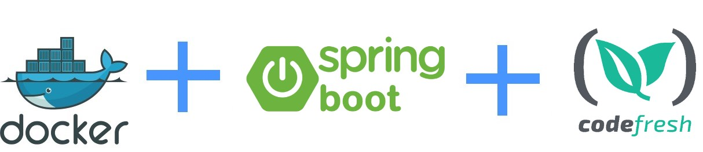

# Dockerized Spring boot 2 application



This is an example Java application that uses Spring Boot 2, Maven and Docker.
It is compiled using Codefresh.

If you are looking for Gradle, then see this [example](https://github.com/codefresh-contrib/gradle-sample-app)


## Instructions

To compile (also runs unit tests)

```
mvn package
```

## To run the webapp manually

```
mvn spring-boot:run
```

....and navigate your browser to  http://localhost:8080/

## To run integration tests

```
mvn spring-boot:run
mvn verify
```

## To create a docker image packaging an existing jar

```
mvn package
docker build -t my-spring-boot-sample . -f Dockerfile.only-package
```

## Create a multi-stage docker image

To compile and package using Docker multi-stage builds

```bash
docker build . -t my-spring-boot-sample
```


## To run the docker image

```
docker run -p 8080:8080 my-spring-boot-sample
```

The Dockerfile also has a healthcheck

## To use this project in Codefresh 


There is also a [codefresh.yml](codefresh.yml) for easy usage with the [Codefresh](codefresh.io) CI/CD platform.

For the simple packaging pipeline see [codefresh-package-only.yml](codefresh-package-only.yml)


More details can be found in [Codefresh documentation](https://codefresh.io/docs/docs/learn-by-example/java/spring-boot-2/)


Enjoy!

